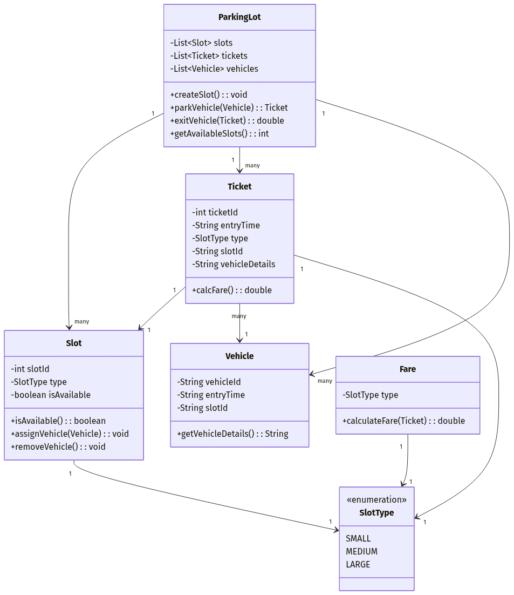

# Parking Lot System

Hey there! I've implemented the Parking Lot system based on the UML diagram provided. It's written in Java and kept very straightforward and easy to read.

## What's Included

- **ParkingLot**: The main class that ties everything together. It handles creating slots, parking vehicles, and managing exits.
- **Slot**: Represents individual parking spaces.
- **SlotType**: An enumeration for the different sizes of slots (SMALL, MEDIUM, LARGE).
- **Vehicle**: Holds the details of a vehicle being parked.
- **Ticket**: Generated when a vehicle successfully parks.
- **Fare**: Calculates the amount to pay when a vehicle exits, based on the slot type.

## How It Works

1. Create a `ParkingLot` instance and add some `Slot`s to it using `createSlot()`.
2. When a car arrives, create a `Vehicle` instance and call `parkVehicle()`. It will find an available slot, assign the vehicle to it, and return a `Ticket`.
3. When the car is ready to leave, pass the `Ticket` to `exitVehicle()`. It frees up the slot and calculates the total fare.

Everything is in the `ParkingLot` folder, ready to use! Enjoy!
