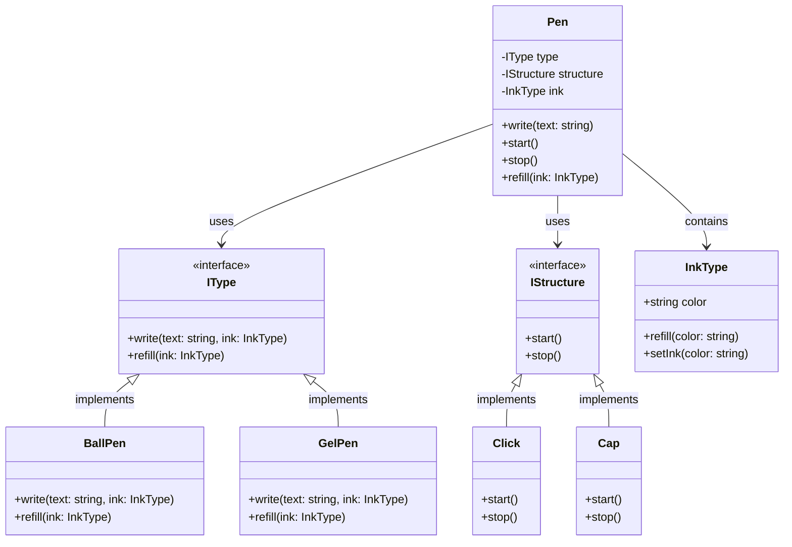

# Pen System

This is a simple system for a Pen implementing the strategy pattern based on the provided UML class diagram. It separates the pen's structure (like Click or Cap) and the pen's writing type (like BallPen or GelPen). The diagram below visualizes the relationships automatically.

## Classes Explained

- **Pen**: The primary class taking an `IType`, `IStructure`, and `InkType`.
- **IType**: Determines the writing mechanism (e.g., `BallPen`, `GelPen`). 
- **IStructure**: Determines the structural mechanism to open or close the pen (e.g., `Click`, `Cap`).
- **InkType**: Represents the ink color and state.
