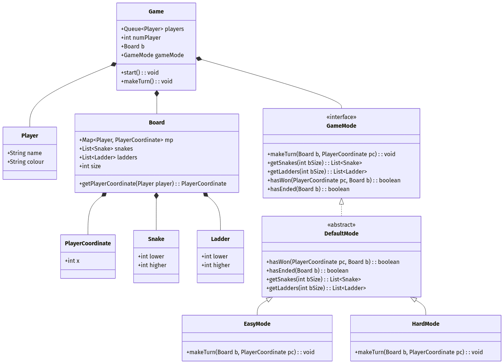

# Snakes And Ladders System

This is a structural representation of a Snakes and Ladders game conforming to the provided UML diagram. The logic is abstracted into `GameMode` to support variations like `EasyMode` and `HardMode`.

## Classes Explained

- **Game**: The engine for the game, holding the players queue, the board, and the current game mode.
- **Board**: Maintains state like ladders, snakes, and player coordinates.
- **Player & PlayerCoordinate**: Represents the user and their precise position.
- **Snake & Ladder**: Entities that move a player's coordinate up or down.
- **GameMode**: An interface to apply rules across different gameplay difficulty modes.
- **DefaultMode**: An abstract class putting the common rule implementations in place, extended by `EasyMode` and `HardMode`.
